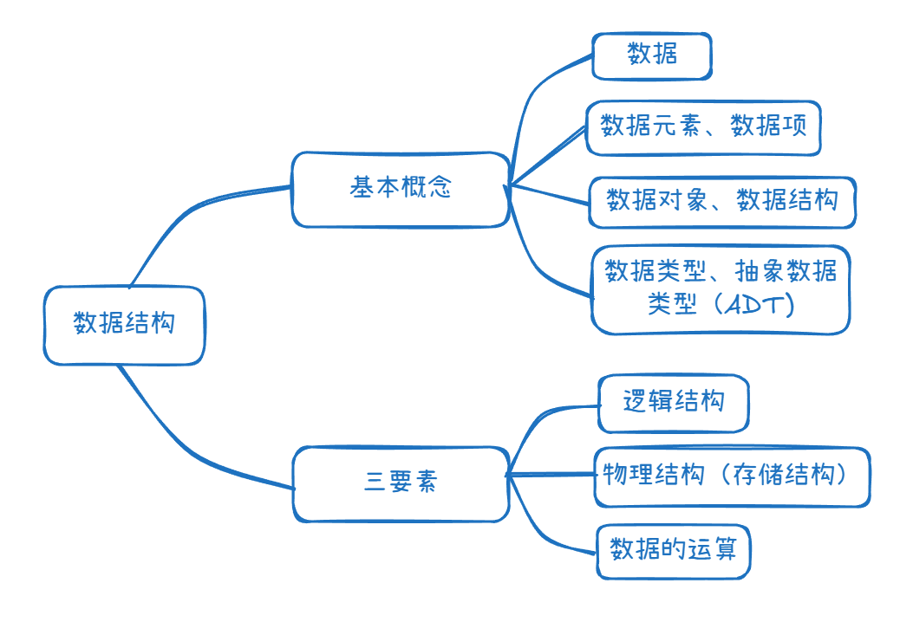
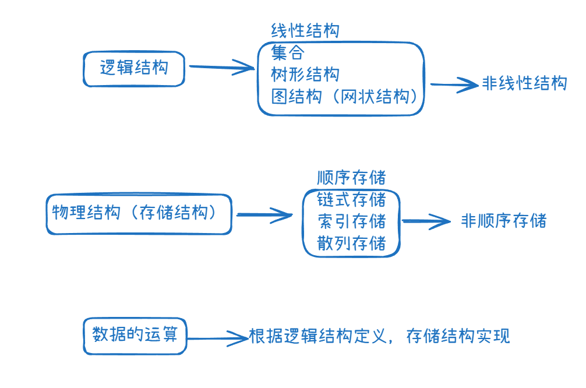

什么是数据结构， 在学什么？

-  如何用程序代码把现实中的问题信息化。
- 如何高效处理信息，从而创造价值。

# 知识总览

**逻辑结构**如线性(一对一)、树(一对多)、图(多对多)、集合

**存储结构**理解三点：

1. 顺序存储，各个元素物理上连续；采用非顺序，物理上可离散
2. 存储结构影响存储空间分配的方便程度，如插入
3. 存储结构影响数据运算速度，如查找

**数据运算**：相关的运算增删改查之类的

**数据类型、抽象数据类型**：

1. 原子类型：int、bool……
2. 结构类型：struct……
3. 抽象数据类型：ADT用数学化的语言定义数据的逻辑结构和运算，与实现无关

运算的**定义**是针对逻辑结构的，指出运算功能；

运算的**实现**是针对存储结构指出运算的具体操作步骤。

---

# 算法

## 基本概念

算法解释为：特定问题求解步骤，指令**有限序列**，每条指令表示一个或多个操作。

程序 = 数据结构 + 算法（有穷、确定、可行、输入和输出）

好算法（正确、可读、稳定-一些非法数据、高效低存储-时间/空间复杂度）

## 时间复杂度

## 空间复杂度