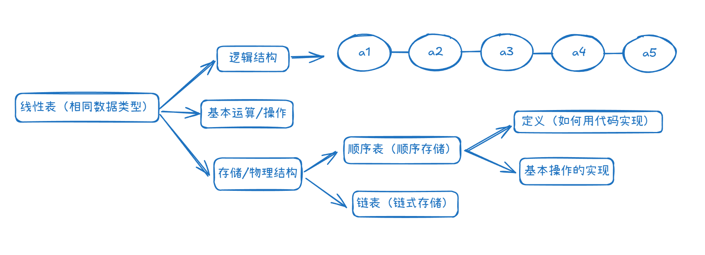
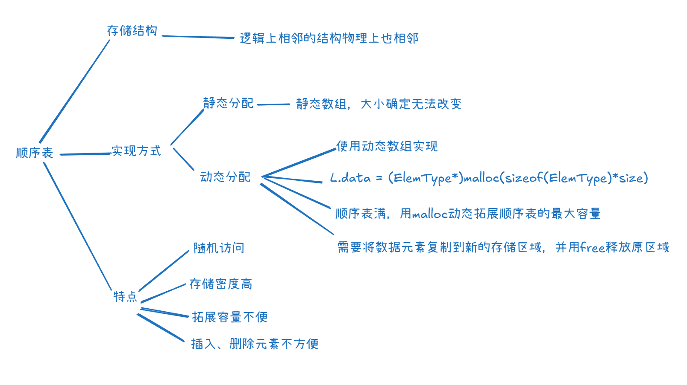

什么是数据结构， 在学什么？

-  如何用程序代码把现实中的问题信息化。
- 如何高效处理信息，从而创造价值。

# 知识总览

**逻辑结构**如线性(一对一)、树(一对多)、图(多对多)、集合

**存储结构**理解三点：

1. 顺序存储，各个元素物理上连续；采用非顺序，物理上可离散
2. 存储结构影响存储空间分配的方便程度，如插入
3. 存储结构影响数据运算速度，如查找

**数据运算**：相关的运算增删改查之类的

**数据类型、抽象数据类型**：

1. 原子类型：int、bool……
2. 结构类型：struct……
3. 抽象数据类型：ADT用数学化的语言定义数据的逻辑结构和运算，与实现无关

运算的**定义**是针对逻辑结构的，指出运算功能；·

运算的**实现**是针对存储结构指出运算的具体操作步骤。

---

# 算法

## 基本概念

算法解释为：特定问题求解步骤，指令**有限序列**，每条指令表示一个或多个操作。

程序 = 数据结构 + 算法（有穷、确定、可行、输入和输出）

好算法（正确、可读、稳定-一些非法数据、高效低存储-时间/空间复杂度）

## 时间复杂度

算法时间复杂度：事前估计算法时间开销 T(n) 与问题规模 n 的关系（T 表示 “time”）

$$T(n) = O(f(n)) \iff\lim\limits_{n\rightarrow \infin}\frac{T(n)}{f(n)}=k$$

多项相加只保留最高阶项，两个相乘合并阶数。

**算法时间复杂度比较：**$O(1)<O(\log_2 n)< O(n)<O(n\log_2 n)<O(n^2)<O(n^3)<O(2^n)<O(n!)<O(n^n)$

求数学期望作为算法复杂度如果存在不同情况的时间复杂度，一般看最坏的，算法的性能问题只有在问题规模 n 很多大时才会暴露出来。

## 空间复杂度

S(n) = O(?) , 算法原地工作——算法所需内存空间为常量。

所需内存空间包括了程序（大小固定与问题规模无关）和数据，主要看存储空间大小和问题规模的关系。

函数调用也会带来内存开销，如递归中。

# 线性表

数据元素同类型，有限，有序；

唯一前驱，唯一后继，除表头和表尾元素，数据元素的位序从1开始

基本操作：创建、销毁、增删改查；判空、判长、打印输出。

## 顺序表

顺序存储方式实现的线性表，空间大小相同

**malloc(size);**

The `malloc()` (stands for `m`emory `alloc`ation) function is used to allocate a single block of contiguous memory on the heap at runtime. The memory allocated by malloc() is uninitialized, meaning it contains garbage values.

**calloc(n, size);** (initialize zeros)

where **n** is the number of elements and **size** is the size of each element in bytes.

This function also returns a void pointer to the allocated memory that is converted to the pointer of required type to be usable. If allocation fails, it returns NULL pointer.

The calloc() (stands for `c`ontiguous `alloc`ation) function is similar to malloc(), but it initializes the allocated memory to zero. It is used when you need memory with default zero values.

**free(ptr)** 

where **ptr** is the pointer to the allocated memory.

After freeing a memory block, the pointer becomes invalid, and it is no longer pointing to a valid memory location.

The memory allocated using functions malloc() and calloc() is not de-allocated on their own. The free() function is used to release dynamically allocated memory back to the operating system. It is essential to free memory that is no longer needed to avoid memory leaks.

**realloc(ptr, new_size);**

where, **ptr** is the pointer to the previously allocated memory block and **new_size** is the reallocated size that the memory block should have in bytes.

realloc() function is used to resize a previously allocated memory block. It allows you to change the size of an existing memory allocation without needing to free the old memory and allocate a new block.

**Notably**, It is important to note that if realloc() fails and returns NULL, the original memory block is not freed, so you should not overwrite the original pointer until you've successfully allocated a new block. To prevent memory leaks, it’s a good practice to handle the NULL return value carefully

插入时判断插入的位序是否有效，是否达到最大容量，顺序表插入的时间复杂度为 O(n).

> ListInsert(SqList &L, int i, int e)

删除则需要前移，O(n)。

> ListDelete(SqList &L, int i, int &e)

顺序表按位查找, O(1).

> GetElem(L, i)

顺序表按值查找, O(n)

> LocateElem(SqList L, int e)